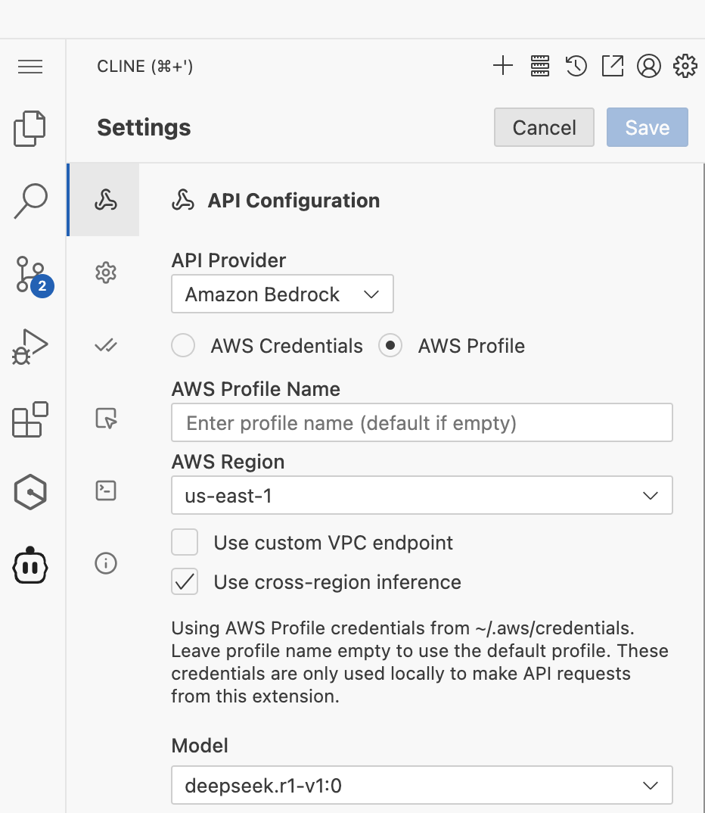
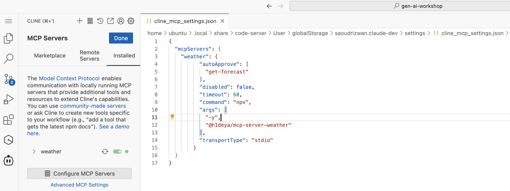

Cline can handle complex software development tasks step-by-step. With tools that let him create & edit files, explore large projects, use the browser, and execute terminal commands (after you grant permission), he can assist you in ways that go beyond code completion or tech support. Cline can even use the Model Context Protocol (MCP) to create new tools and extend his own capabilities. While autonomous AI scripts traditionally run in sandboxed environments, this extension provides a human-in-the-loop GUI to approve every file change and terminal command, providing a safe and accessible way to explore the potential of agentic AI.

https://github.com/cline/cline

Cline with Bedrock models 

Cline with MCP

