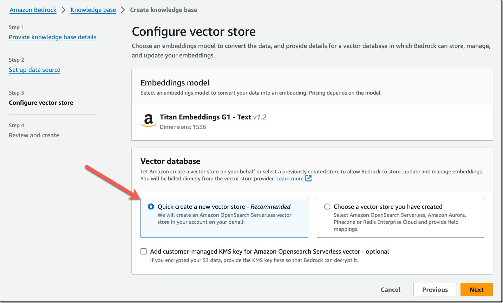
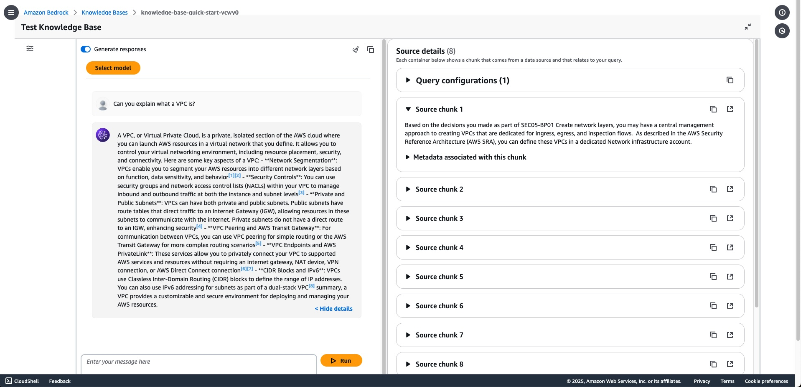
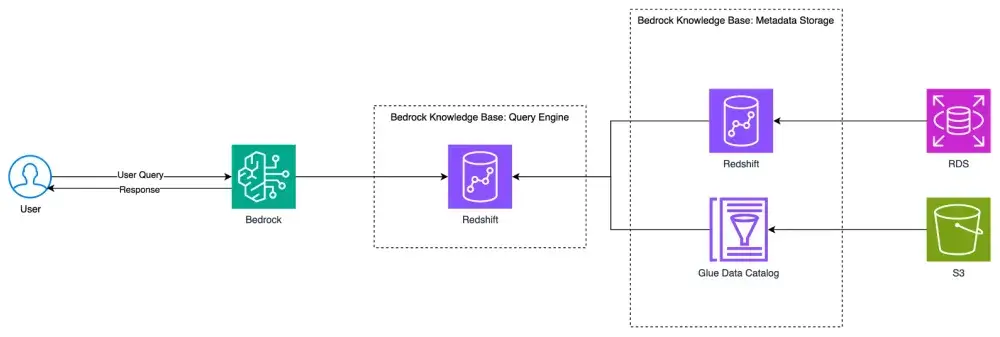
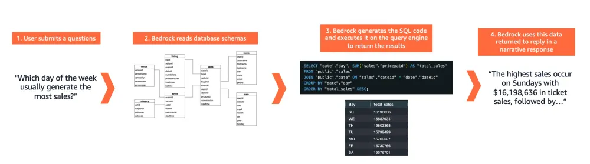
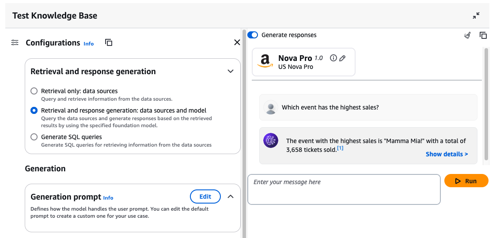
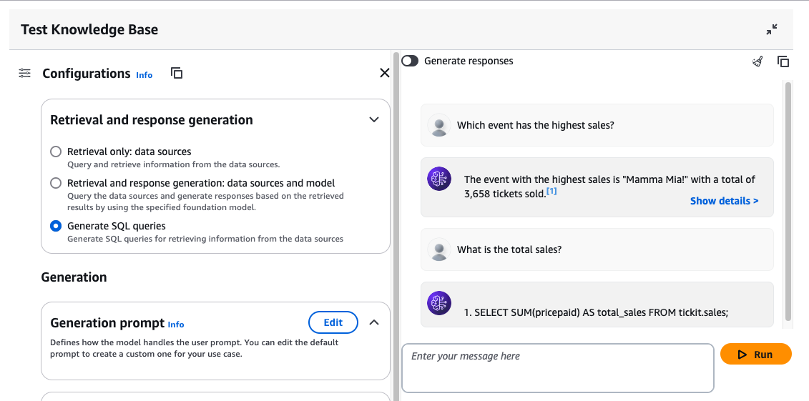

## Unstructured data (Text/Image/Video) RAG

Knowledge Bases gives you a fully managed RAG experience and the easiest way to get started with RAG in Amazon Bedrock. Knowledge Bases now manages the initial vector store setup, handles the embedding and querying, and provides source attribution and short-term memory needed for production RAG applications. If needed, you can also customize the RAG workflows to meet specific use case requirements or integrate RAG with other generative artificial intelligence (AI) tools and applications.

You will see the results with test playground

Knowledge Bases now delivers fully managed RAG experience in Amazon Bedrock
https://aws.amazon.com/blogs/aws/knowledge-bases-now-delivers-fully-managed-rag-experience-in-amazon-bedrock/

## Structured data NL2SQL

Amazon Bedrock Knowledge Bases now supports connecting to a structured data store for users to use natural language querying to retrieve structured data from your data sources. Using advanced natural language processing (NL2SQL), Bedrock Knowledge Bases can transform natural language queries into SQL queries, executes the query on the querying engine, and returns the results in a summarized narrative response. Here is the architecture:

Detailed information can be found at Bedrock Knowledge Bases: Structured Data Retrieval
https://community.aws/content/2vHwBHeBsosvfMsxtR9tASsmLgW/bedrock-knowledge-bases-structured-data-retrieval

Example question: Which event has the highest sales?

Example question: What is the total sales?

