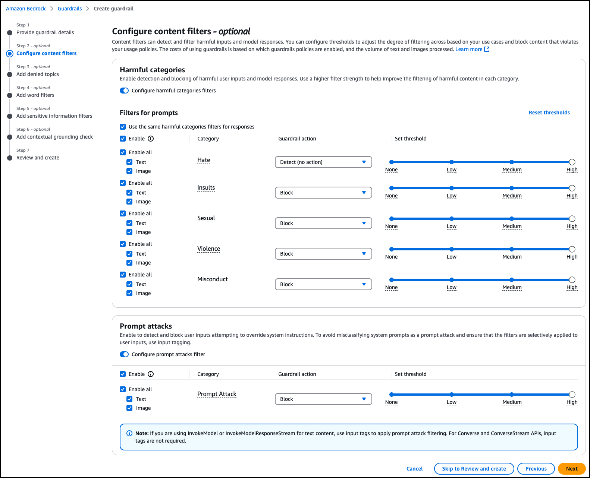
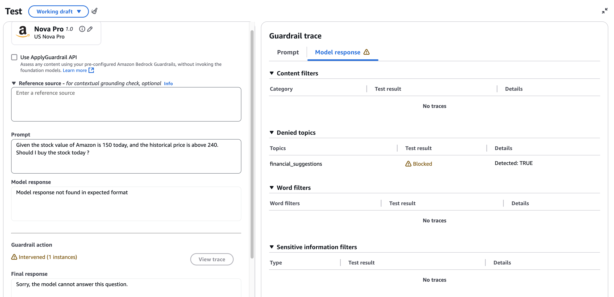
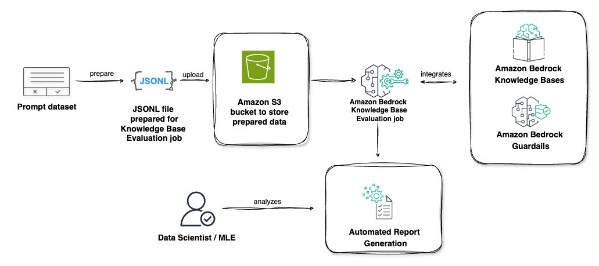
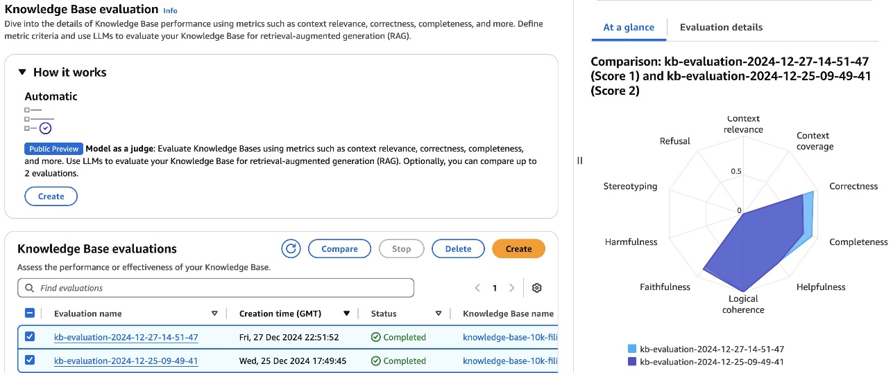
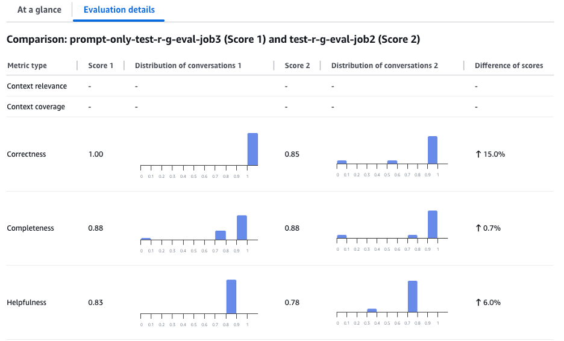

## Guardrail

Amazon Bedrock Guardrails is a comprehensive security solution that detects harmful multimodal content with 88% accuracy, filters sensitive information, and prevents hallucinations across multiple foundation models (FMs). Through its ApplyGuardrail API, it offers configurable policies including content filters, denied topics, sensitive information filters, word filters, contextual grounding checks, and Automated Reasoning, enabling organizations to implement consistent AI safety controls while maintaining compliance. The service works with both Amazon Bedrock models and custom-deployed models, providing centrally managed safeguards that can be tailored to specific industries and use cases, ultimately ensuring safe AI application deployment through mathematical and logic-based algorithmic verification.

The new capabilities for Amazon Bedrock Guardrails represent our continued commitment to helping customers implement responsible AI practices effectively at scale. Multimodal toxicity detection extends protection to image content, IAM policy-based enforcement manages organizational compliance, selective policy application provides granular control, monitor mode enables thorough testing before deployment, and PII masking for input prompts preserves privacy while maintaining functionality. Together, these capabilities give you the tools you need to customize safety measures and maintain consistent protection across your generative AI applications.

API experience: 

Guardrails for Amazon Bedrock can now detect hallucinations and safeguard apps built using custom or third-party FMs
https://aws.amazon.com/blogs/aws/guardrails-for-amazon-bedrock-can-now-detect-hallucinations-and-safeguard-apps-built-using-custom-or-third-party-fms/

API example: 
https://docs.aws.amazon.com/bedrock/latest/userguide/guardrails-use-independent-api.html

Example of using Guardrail API for streaming 
Use the ApplyGuardrail API with long-context inputs and streaming outputs in Amazon Bedrock
https://aws.amazon.com/blogs/machine-learning/use-the-applyguardrail-api-with-long-context-inputs-and-streaming-outputs-in-amazon-bedrock/

## Evaluation

Amazon Bedrock has recently launched two new capabilities to address these evaluation challenges: LLM-as-a-judge (LLMaaJ) under Amazon Bedrock Evaluations and a brand new RAG evaluation tool for Amazon Bedrock Knowledge Bases. Both features rely on the same LLM-as-a-judge technology under the hood, with slight differences depending on if a model or a RAG application built with Amazon Bedrock Knowledge Bases is being evaluated. These evaluation features combine the speed of automated methods with human-like nuanced understanding, enabling organizations to:

- Assess AI model outputs across various tasks and contexts
- Evaluate multiple evaluation dimensions of AI performance simultaneously
- Systematically assess both retrieval and generation quality in RAG systems
- Scale evaluations across thousands of responses while maintaining quality standards

Evaluating RAG applications with Amazon Bedrock knowledge base evaluation
https://aws.amazon.com/blogs/machine-learning/evaluating-rag-applications-with-amazon-bedrock-knowledge-base-evaluation/

Test with sample data: 

https://github.com/aws-samples/amazon-bedrock-samples/tree/main/evaluation-observe/bedrock-eval-bring-your-own-inference/sample-data

