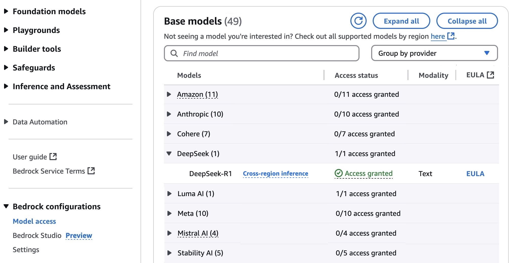
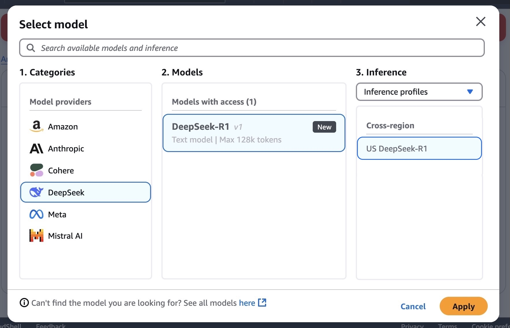
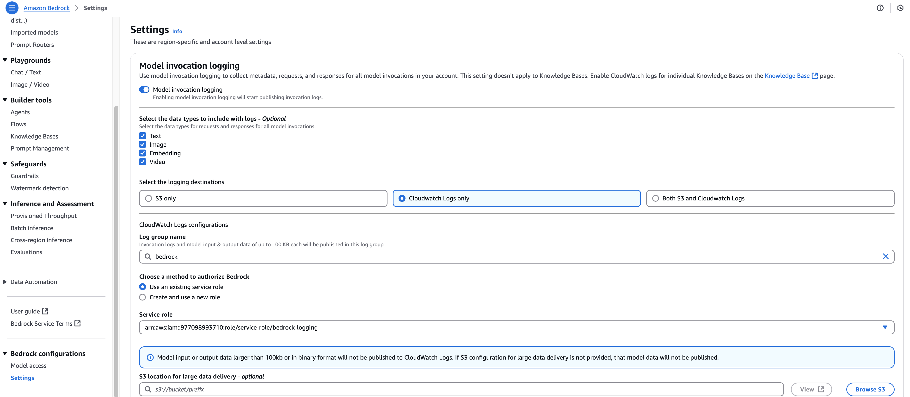
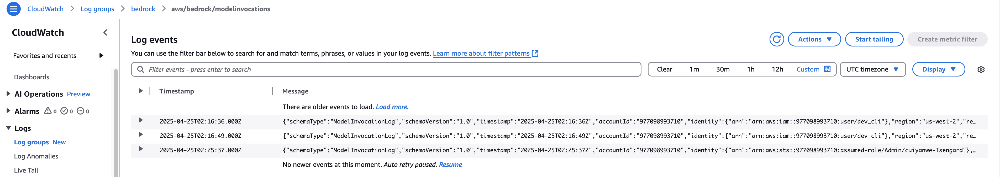

Amazon Bedrock is a fully managed service that offers a choice of high-performing foundation models (FMs) from leading AI companies like AI21 Labs, Anthropic, Cohere, DeepSeek, Luma, Meta, Mistral AI, poolside (coming soon), Stability AI, TwelveLabs (coming soon), and Amazon through a single API, along with a broad set of capabilities you need to build generative AI applications with security, privacy, and responsible AI.

DeepSeek-R1 now available as a fully managed serverless model in Amazon Bedrock
https://aws.amazon.com/blogs/aws/deepseek-r1-now-available-as-a-fully-managed-serverless-model-in-amazon-bedrock/

In order to access the model, you can follow Bedrock configuration then Model access

Once configured, you can check the Bedrock Chat Playgournd

The code sample official user guide
https://docs.aws.amazon.com/bedrock/latest/userguide/model-parameters-deepseek.html

### Observability and logging

You can use model invocation logging to collect invocation logs, model input data, and model output data for all invocations in your AWS account used in Amazon Bedrock in a Region.

With invocation logging, you can collect the full request data, response data, and metadata associated with all calls performed in your account in a Region. Logging can be configured to provide the destination resources where the log data will be published. Supported destinations include Amazon CloudWatch Logs and Amazon Simple Storage Service (Amazon S3). Only destinations from the same account and Region are supported.

Model invocation logging is disabled by default. After model invocation logging is enabled, logs are stored until the logging configuration is deleted.

